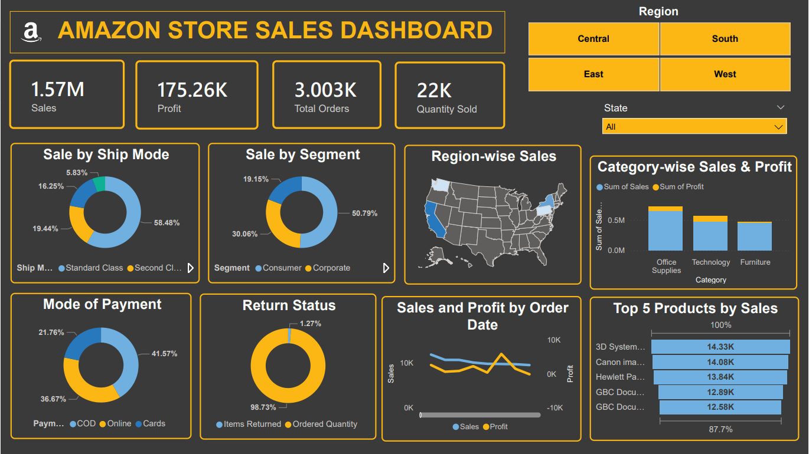

# 🛒 Amazon Sales Performance Dashboard

## 📌 Overview

This Power BI dashboard analyzes Amazon store sales data to uncover key trends in revenue, profitability, customer behavior, product performance, and regional sales distribution.

The project transforms raw sales data into actionable business insights through interactive visualizations, KPI tracking, and dynamic filtering.

---

## 📊 Dashboard Preview

---

## 🎯 Business Objective

E-commerce businesses generate large volumes of transactional data, making it difficult to identify:

- High-performing products
- Profitable customer segments
- Regional sales opportunities
- Revenue and profit trends
- Customer purchasing behavior

This dashboard helps stakeholders monitor performance and make data-driven decisions.

---

## 📈 Key Metrics

| Metric | Value |
|----------|----------|
| Total Sales | 1.57M |
| Total Profit | 175.26K |
| Total Orders | 3,003 |
| Quantity Sold | 22K |

---

## 🔍 Key Insights

### 🛍 Product Performance
- Office Supplies generated the highest sales contribution.
- Technology products delivered strong profitability.
- Furniture showed comparatively lower sales performance.

### 👥 Customer Segmentation
- Consumer customers accounted for the largest share of sales.
- Corporate customers contributed significantly to overall revenue.

### 🚚 Shipping Analysis
- Standard Class was the most preferred shipping method.
- Expedited shipping options represented a smaller portion of total orders.

### 🌎 Regional Analysis
- Sales distribution varied across regions and states.
- Certain locations consistently contributed higher revenue than others.

### 💳 Payment Preferences
- Customers used a mix of COD, Online Payments, and Card Transactions.
- Payment method trends provide insights into customer purchasing behavior.

### ⭐ Top Products
- Identified top-selling products driving overall revenue growth.
- Insights can support inventory and marketing decisions.

---

## 📊 Dashboard Features

- Interactive KPI Cards
- Region & State Filters
- Product Category Analysis
- Sales & Profit Trend Analysis
- Customer Segment Analysis
- Shipping Mode Analysis
- Payment Method Insights
- Top Product Performance Tracking
- Return Status Monitoring

---

## 🛠 Tools & Technologies

- Power BI
- DAX
- Power Query
- Data Modeling
- Data Visualization

---

## 💡 Business Recommendations

- Focus marketing efforts on high-performing product categories.
- Optimize inventory planning using top-selling product insights.
- Expand strategies in high-revenue regions.
- Improve performance of underperforming categories.
- Monitor return trends to reduce operational losses.

---

## 📂 Repository Contents

| File | Description |
|--------|-------------|
| Amazon-Sales-Dashboard.pbix | Power BI dashboard file |
| Amazon-Sales-Dataset.csv | Dataset used for analysis |
| dashboard-overview.png | Dashboard preview image |

---

## Author

**Medhavi Agrawal**  
Aspiring Data Analyst | Power BI | SQL | Excel
